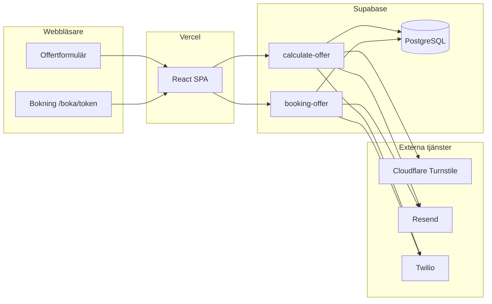

# Arkitektur

## Översikt

## Huvudflöden

### 1. Offertförfrågan (`calculate-offer`)

1. Användaren skickar formulär från `src/App.jsx` (inkl. `turnstileToken` om Turnstile är konfigurerat).
2. Edge-funktionen:
   - Verifierar **Turnstile** (`turnstile.ts`)
   - Kontrollerar **rate limit** (10 lyckade förfrågningar/timme per IP och e-post, `offerRateLimit.ts`)
   - Validerar fält och affärsregler
   - Beräknar pris från pris-tabeller eller RPC, eller svarar med **manuell offert**
   - Sparar `offert_förfrågan` (+ vid auto: `kund_offert` atomiskt via `saveAutoQuoteAtomic`)
   - Skickar e-post/SMS (`offerDelivery.ts`) med bokningslänk `/boka/{token}`
3. Frontend visar tack-meddelande, ev. gul varning om leverans misslyckades (`offerDeliveryMessage.js`).

**Viktigt:** Rate limit-räknaren ökas endast när captcha passerat och gränsen inte är nådd (innan beräkning slutförs).

### 2. Bokning (`booking-offer`)

1. Kund öppnar `https://{app}/boka/{boknings_token}` (legacy `?bookingToken=` migreras till path i `bookingPath.js`).
2. `action: "get"` – verifiera token + e-post mot `kund_offert`, returnera offert och ev. befintlig `kund_bokningar`.
3. `action: "book"` – acceptera offert, validera datum (inte i det förflutna, Europe/Stockholm), `claimOrUpdateBooking` (insert-first, idempotent vid parallella anrop).
4. Bekräftelse via Resend/Twilio (`bookingConfirmation.ts`) endast vid ny eller ombokad bokning – inte vid `already_booked`.

## Säkerhet

Kort översikt – fullständig lista och motivering: **[security.md](security.md)**.

| Åtgärd | Implementation |
|--------|----------------|
| Bot-skydd | Cloudflare Turnstile före beräkning |
| Missbruk | `offer_rate_limit_events`, 429 vid gräns |
| Kunddata i API-svar | `toPublicCalculateOfferQuote` – ingen token/e-post/telefon i JSON |
| Bokning | Token i URL-path; åtkomst kräver matchande e-post (`bookingTokenAuth.ts`) |
| DB åtkomst | RLS på känsliga tabeller; edge functions använder service role |
| Turnstile-token | Frontend skickar inte om samma token vid `FunctionsHttpError` (engångs-token) |

## Frontend – viktiga moduler

| Fil | Roll |
|-----|------|
| `App.jsx` | Offertformulär, submit, `invokeEdgeFunction`, boknings-UI |
| `formConfig.js` | Tjänster, fältregler, etiketter |
| `formValidation.js` | Klientvalidering |
| `TurnstileField.jsx` | Cloudflare-widget |
| `offerSubmitErrors.js` | Kundvänliga felmeddelanden |
| `bookingPath.js` | `/boka/{token}`, bas-URL för e-postlänkar |
| `lib/supabase.js` | Supabase-klient |

## Backend – Edge Functions

| Function | Mapp |
|----------|------|
| `calculate-offer` | `supabase/functions/calculate-offer/` – monolitisk `index.ts` + moduler för pris, insert, leverans |
| `booking-offer` | `supabase/functions/booking-offer/` |

Deno-importer använder `esm.sh` för `@supabase/supabase-js`.

## Databas – kärntabeller

Se [domain-glossary.md](domain-glossary.md) för detaljer.

- `offert_förfrågan` – alla inkommande förfrågningar (`status`: `auto` | `manuell`)
- `kund_offert` – genererad offert + `boknings_token`
- `kund_bokningar` – bokning kopplad till offert
- `bostads_priser`, `företags_priser`, `fönsterputs_priser`, … – prisunderlag
- `offer_rate_limit_events` – rate limit (endast service role)

## Hosting

- **Vercel:** SPA, `vercel.json` (SPA-rewrite, CSP `frame-ancestors` för inbäddning på t.ex. valstadat.com).
- **Supabase:** DB, migrationer, Edge Function secrets, function deploy.

Relaterat: [deployment.md](deployment.md), [environment-and-secrets.md](environment-and-secrets.md).
