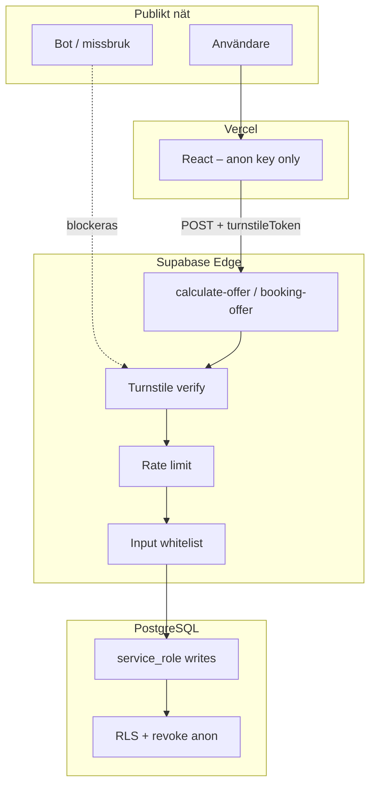

# Säkerhet

Översikt över **säkerhetsåtgärder som är implementerade** i KlaraStäd offertkalkylatorn. Dokumentet är avsett för utvecklare som tar över drift och vidareutveckling.

Relaterat: [architecture.md](architecture.md), [environment-and-secrets.md](environment-and-secrets.md), [runbook-troubleshooting.md](runbook-troubleshooting.md).

---

## Säkerhetsmodell i korthet

| Lager | Princip |
|-------|---------|
| **Publik frontend** | Endast Supabase **anon key** (avsiktligt). Ingen `service_role` i browser. |
| **Edge Functions** | All affärslogik, validering och DB-skrivning med **service role** (bypassar RLS kontrollerat). |
| **Databas** | RLS på känsliga tabeller; **revoke** för `anon`/`authenticated` på PII och tokens. |
| **Extern exponering** | Offentliga functions kan anropas med anon JWT – skyddas med captcha, rate limit och servervalidering. |



---

## 1. Bot-skydd – Cloudflare Turnstile

**Syfte:** Hindra automatiserade massanrop mot `calculate-offer` (spam, databasfyllning, Resend/Twilio-kostnader).

| Del | Implementation |
|-----|----------------|
| Frontend | `TurnstileField.jsx`, `VITE_TURNSTILE_SITE_KEY` |
| Backend | `turnstile.ts` – server-side `siteverify` mot Cloudflare |
| Secret | `TURNSTILE_SECRET_KEY` endast i Supabase (aldrig i Vercel `VITE_*`) |
| Dev | Om secret saknas: verifiering hoppas över (loggvarning) |

**Ordning:** Turnstile körs **före** rate limit och prisberäkning (`index.ts`).

**Turnstile-token:** Engångs. Frontend skickar **inte** om samma token vid fel (`shouldRetryEdgeFunctionInvoke` i `App.jsx`) – motverkar `timeout-or-duplicate`.

**Drift:** Hostnames måste vara allowlistade i Cloudflare (prod-domän + `localhost`).

---

## 2. Rate limiting (missbruk / kostnad)

**Syfte:** Begränsa antal lyckade offertförfrågningar per timme.

| Inställning | Standard |
|-------------|----------|
| `OFFER_RATE_LIMIT_MAX_PER_HOUR` | 10 |
| Fönster | Rullande 60 minuter |
| Dimensioner | Per **IP** och per **normaliserad e-post** |

**Implementation:** `offerRateLimit.ts`, tabell `offer_rate_limit_events`.

**Viktigt:**

- Räknas endast efter godkänd captcha och under gränsen (`recordOfferRateLimitEvent` efter `assertOfferRateLimit`).
- Misslyckade captcha-försök räknas **inte**.
- Vid gräns: HTTP **429** med svensk feltext.
- Tabellen: RLS på, `revoke all` för `anon` och `authenticated` (migration `20260521160000`).

**Lokal test:** `DISABLE_OFFER_RATE_LIMIT=1` (endast dev/integration).

---

## 3. Databas – RLS och åtkomstkontroll

Tidigare kunde `anon` skriva/läsa vissa tabeller direkt via PostgREST. Det är **stängt** för kunddata.

### Tabeller utan publik åtkomst (revoke + RLS, inga anon-policies)

| Tabell | Innehåll | Migration (exempel) |
|--------|----------|---------------------|
| `offert_förfrågan` | PII, samtycke, förfrågandata | `20260519150000_lock_down_offert_forfragan_rls.sql` |
| `kund_offert` | Offert, telefon, e-post, **boknings_token** | `20260521140000_lock_down_kund_offert_and_kund_bokningar_rls.sql` |
| `kund_bokningar` | Bokningsdatum, koppling till offert | samma |
| `offer_rate_limit_events` | IP + e-post för rate limit | `20260521160000` |

**Konsekvens:** Klient med anon key kan **inte** SELECT/INSERT/UPDATE/DELETE på dessa tabeller. All åtkomst går via Edge Functions med **service role**.

### Pris-tabeller

Tabeller som `bostads_priser`, `företags_priser`, `fönsterputs_priser` har **RLS aktiverat** utan öppna anon-policies i senare migrationer → i praktiken läses de endast från Edge Functions (service role).

**Undantag:** `kontors_arbetsplats_priser` har policy **public read** (`for select using (true)`). Innehåller endast prisintervall för arbetsplatser – ingen PII. Beräkning sker ändå server-side i prod-flödet.

### RPC / funktioner

`spara_auto_offert_atomic(jsonb, jsonb)` – endast **`service_role`** får `EXECUTE` (`20260521150100_grant_spara_auto_offert_atomic.sql`). Förhindrar att anon kör atomisk offert-sparning direkt mot DB.

---

## 4. Edge Functions som enda skrivväg

| Function | Skrivning | Läsning av känslig data |
|----------|-----------|-------------------------|
| `calculate-offer` | `offert_förfrågan`, `kund_offert`, rate limit events | Priser via service role |
| `booking-offer` | `kund_bokningar` (insert-first) | `kund_offert` med token + e-postcheck |

**Service role** lagras endast i Supabase runtime – injiceras som `SUPABASE_SERVICE_ROLE_KEY`, committas inte i repo (`.gitignore`: `.env`).

---

## 5. Bokningslänk och token

### Token i URL-path (inte query)

| Åtgärd | Var |
|--------|-----|
| Länkformat `/boka/{token}` | `bookingUrl.ts`, `bookingPath.js` |
| Legacy `?bookingToken=` migreras bort från adressfältet | `migrateLegacyBookingTokenInUrl()` |

**Syfte:** Minska exponering i browser history, server access logs, `Referer` och delade skärmdumpar jämfört med query string.

### Token-generering och giltighetstid

| Åtgärd | Detalj |
|--------|--------|
| Token | `crypto.randomUUID()` utan bindestreck (`index.ts`) |
| TTL | `BOOKING_TOKEN_TTL_DAYS` (standard **30** dagar) |
| DB-default | Migration `20260520113500` – clamp befintliga rader |
| Utgång | `isBookingTokenExpired()` i `bookingTokenAuth.ts` |

### Åtkomst till offert via token

`booking-offer` kräver:

1. Giltig `boknings_token` som matchar rad i `kund_offert`
2. **E-post** som matchar `kund_offert.epost` (normaliserad, case-insensitive)
3. Token inte utgången

Vid fel: generiskt **404**-meddelande (`BOOKING_ACCESS_ERROR`) – avslöjar inte om token eller e-post var fel.

### Publik offertdata vid bokning

`toPublicBookingOffer()` returnerar **inte** telefon, e-post eller token – endast id, tjänst, pris, stad, skapad.

---

## 6. Allowlist för boknings-URL i e-post/SMS

**Syfte:** Förhindra att skadliga `bookingPageUrl` / `Referer` / `Origin` pekar offertmail till phishing-domäner.

`bookingUrl.ts`:

- `DEFAULT_ALLOWED_BOOKING_HOSTS` (prod-Vercel, localhost, …)
- `BOOKING_PAGE_ALLOWED_HOSTS` (kommaseparerad utökning)
- Hostname från `BOOKING_PAGE_URL`
- Endast `http:` / `https:`

Om ingen godkänd bas-URL: tom bokningslänk + logg (offert sparas ändå).

---

## 7. Begränsat API-svar (data minimization)

`toPublicCalculateOfferQuote()` (`publicQuoteResponse.ts`) exponerar **inte** i JSON-svar:

- `boknings_token`
- `telefon` / `epost`
- Interna leveransdetaljer utöver avsedda fält

Integrationstester verifierar detta (`tests/integration/calculate-offer.test.js`).

---

## 8. Server-side inputvalidering

Alla offertfält valideras i `calculate-offer/index.ts` med **whitelist**:

- `supportedServices` – fast mängd tjänstetyper
- `allowedPropertyTypes`, `allowedFrequencies`, `allowedWindowTypes`, …
- `consent` måste vara `true`
- Rum/kvm/fönster enligt `roomCountRules`, `squareMetersRules`, `windowCountRules`
- Bokningsdatum: regex + inte före idag i **Europe/Stockholm** (`booking-offer`)

**Syfte:** Förhindra injection av ogiltiga enum-värden och överbelastande tal även om någon kringgår frontend.

---

## 9. Klientvalidering och sanering

Komplement till server (UX, tidig feedback):

| Modul | Roll |
|-------|------|
| `formValidation.js` | Obligatoriska fält, e-postformat, captcha om konfigurerad |
| `sanitizeRoomCountInput`, `sanitizeSquareMetersInput`, … | Tak/min per tjänst/boende |
| `sanitizeMobilePhoneInput` | Telefonformat |

Servern är **auktoritativ** – klienten kan inte lita på ensam.

---

## 10. Samtycke (GDPR-relaterat)

- Checkbox i formulär (`consent`)
- Backend avvisar om `consent !== true` (400)
- Sparas på `offert_förfrågan`

---

## 11. Idempotens och race conditions

### Parallella bokningar

`claimOrUpdateBooking()` (`bookingPersistence.ts`):

- **Insert-first** på `kund_bokningar`
- Vid unik-konflikt (`23505`): läs befintlig rad, `already_booked` eller `rescheduled`
- Bekräftelsemail/SMS skickas **inte** vid `already_booked`

**Syfte:** En bekräftelse per offert även vid dubbelklick eller parallella requests.

### Atomisk auto-offert

`saveAutoQuoteAtomic` / `spara_auto_offert_atomic` – förfrågan + `kund_offert` i en transaktion.

---

## 12. E-post och XSS

HTML i e-post (offert, admin-alert, bokningsbekräftelse) använder **`escapeHtml()`** på dynamiska fält (`index.ts`, `offerDelivery.ts`, `bookingConfirmation.ts`).

**Syfte:** Minska risk för HTML-injection i mailklienter om fält innehåller `<script>` etc.

---

## 13. Hemligheter och konfiguration

| Regel | Implementation |
|-------|----------------|
| `.env` i `.gitignore` | Lokala secrets committas inte |
| Endast `VITE_*` i frontend | Publika nycklar (Supabase anon, Turnstile site key) |
| API-nycklar för Resend/Twilio/Turnstile secret | Supabase Edge secrets |
| Admin vid leveransfel | `OFFER_DELIVERY_ALERT_EMAIL` |

Se [environment-and-secrets.md](environment-and-secrets.md).

---

## 14. Hosting och inbäddning

### Vercel (`vercel.json`)

**Content-Security-Policy:** `frame-ancestors` begränsar vilka domäner som får bädda in appen i iframe (t.ex. `valstadat.com`, Lovable-domäner).

**Syfte:** Minska clickjacking / oönskad inbäddning på okända sajter.

### CORS på Edge Functions

`Access-Control-Allow-Origin: *` på `calculate-offer` och `booking-offer`.

**Motivering:** Publik formulärapp; skydd ligger i captcha, rate limit och validering – inte i browser CORS alone. Om appen endast ska anropas från en domän kan detta stramas åt i framtiden.

---

## 15. Övriga skydd

| Åtgärd | Detalj |
|--------|--------|
| **Metod** | Endast `POST` (+ `OPTIONS`) på edge handlers |
| **Ogiltig JSON** | 400, ingen krasch |
| **Dubblett Turnstile-anrop** | Fix i `invokeEdgeFunction` (se avsnitt 1) |
| **Turnstile `remoteip`** | Skickas endast om giltig IP – inte `unknown` (`turnstile.ts`) |
| **Supabase API `max_rows`** | 1000 i `config.toml` (lokal referens) |

---

## 16. Kända begränsningar och residual risk

| Risk | Status / kommentar |
|------|---------------------|
| Anon key är publik i frontend | Förväntat Supabase-mönster; skrivskydd via RLS + functions |
| Någon kan fortfarande *anropa* functions med anon JWT | Mitigerat med Turnstile + rate limit + validering |
| Rate limit per IP kan påverkas bakom NAT | E-postdimensionen finns som komplement |
| `kontors_arbetsplats_priser` publik läsning | Endast prisdata; överväg att stänga om ej behövd |
| CORS `*` | Medvetet; kan hårdas om krav finns |
| Ingen WAF dokumenterad i repo | Cloudflare/Vercel WAF är infrastruktur utanför kodbasen |
| Hemligheter i Supabase Dashboard | Kräver åtkomstkontroll på team-nivå |

---

## 17. Säkerhetsrelaterade migrationer (referens)

| Migration | Åtgärd |
|-----------|--------|
| `20260519150000` | Lock down `offert_förfrågan` |
| `20260521140000` | Lock down `kund_offert`, `kund_bokningar` |
| `20260521160000` | `offer_rate_limit_events` + revoke |
| `20260521150100` | `spara_auto_offert_atomic` endast service_role |
| `20260520113500` | Kortare boknings-token-TTL (30 dagar) |

---

## 18. Checklista vid nya features

- [ ] Kräver nya tabeller **RLS** och revoke för `anon`/`authenticated` om de innehåller PII?
- [ ] Skrivning endast via Edge Function med service role?
- [ ] Exponeras inga tokens/telefon/e-post i publika API-svar?
- [ ] Server-side whitelist för nya enum/fält?
- [ ] Behöver ny publik endpoint **rate limit** eller captcha?
- [ ] HTML i mail – `escapeHtml` på alla dynamiska värden?
- [ ] Nya secrets dokumenterade i `.env.example` + [environment-and-secrets.md](environment-and-secrets.md)?

---

## 19. Verifiering

| Test / kontroll | Vad det bevisar |
|-----------------|-----------------|
| `tests/integration/calculate-offer.test.js` | Quote-svar utan token/PII |
| `bookingTokenAuth.test.ts` | Utgången token, e-postmatch |
| `offerSubmitErrors.test.js` | Kundvänliga fel utan läckage av engelska API-strängar |
| Manuell: anon client mot `kund_offert` | Ska misslyckas (RLS) |
| Supabase Logs | Turnstile/rate limit vid missbruk |

```bash
npm run test:unit
npm run test:integration:local   # med lokal Supabase
```
